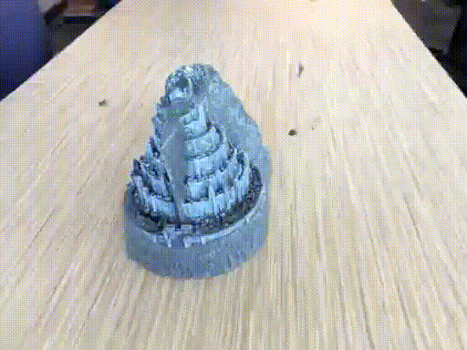

# DeMask-NeRF


DeMask-NeRF is a neural rendering method for restoring masked realistic scene images. Here are some videos generated by this project:




This project takes [NeRF-pytorch](https://github.com/yenchenlin/nerf-pytorch) as the backbone. The method of application is very similar to NeRF
## Installation

```
pip install -r requirements.txt
```

<details>
  <summary> Dependencies (click to expand) </summary>
  
  ## Dependencies
  - PyTorch 1.4
  - matplotlib
  - numpy
  - imageio
  - imageio-ffmpeg
  - configargparse
  

  
</details>

## How To Run?

### Quick Start

To train a low-res `fern` NeRF(About 20G GPU memory is required. GeForce RTX 3090 or better GPU is recommended):
```
python run_nerf.py --config configs/fern.txt
```
After training for 100k iterations (~24 hours on a single RTX 3090), you can find the result at `fern_test/fern_ours`.
The directory structure of result is as following.
```                                                                                            
├── fern_ours       
│   ├── Result # the final output                                                                                                                                                                                                 
│   ├── Renew_stage # output of the model during the renew stage (full views)                                                                                                   
│   │ └── 10000                                                                                                                                    
│   │ └── ...                                                                              
│   │ └── 100000
│   ├── NewData # updated training set                                                                                                 
│   │ └── 10000                                                                                                                                    
│   │ └── ...                                                                              
│   │ └── 100000
|   └── ...     
```
---
### More Datasets
1. To play with other scenes presented in the paper, download the data [here](https://drive.google.com/drive/folders/128yBriW1IG_3NJ5Rp7APSTZsJqdJdfc1).Supported scenes can be checked in the directory "configs". Place the downloaded dataset according to the following directory structure:
```
├── configs                                                                                                       
│   ├── ...                                                                                     
│                                                                                               
├── data                                                                                                                                                                                                       
│   ├── LLFF-M                                                                                                  
│   │   └── fern                                                                                                                             
│   │   └── flower  # downloaded llff dataset                                                                                  
│   │   └── horns   # downloaded llff dataset
│   │   └── ...
``` 
2. Use the script located in the utils directory to convert LLFF dataset to LLFF-M dataset.We strongly recommend using image_8.Because our method requires a large amount of GPU memory.
``` 
├── utils
│   ├── squareImages # Please put the picture of LLFF-M dataset to be converted into square mask into this folder!!
│   ├── circleImages # Please put the picture of LLFF-M dataset to be converted into circle mask into this folder!!                                                                                                                                                                                                         
│   ├── mask2square.py # the file to convert LLFF dataset to LLFF-M dataset with square mask                                                                                             
│   ├── mask2circle.ipynb # the file to convert LLFF dataset to LLFF-M dataset with circle mask                                                                                                                         

```
3. Properly store the prepared LLFF-M data set:
``` 
├── data                                                                                                                                                                                                       
│   ├── LLFF-M                                                                                                  
│   │   ├── fern                                                                                                                             
│   │   │   └── images_8 # unprocessed LLFF data   
│   │   │   └── images_8_mask25%_square_random # dataset with 25% mask level, random mask position and square mask shape                                                                               
``` 
---

To train NeRF on different datasets: 

```
python run_nerf.py --config configs/{DATASET}.txt --mask={LEVEL} --shape={SHAPE} --position={POSITION} --patch_size={SIZE}

# ex) python run_nerf.py --config configs/fern.txt --mask=25 --shape=square --position=random --patch_size=10
```

replace `{DATASET}` with `trex` | `horns` | `flower` | `fortress` | `flower` | etc.

replace `{LEVEL}` with `25` | `50` | `75`  | etc.

replace `{SHAPE}` with `square` | `circle`.

replace `{POSITION}` with `random` | `fix` .

replace `{SIZE}` with `10` | `15` |  `20` |  etc.

If your GPU memory is not enough, you can consider using the following instructions. This may affect the quality of the result:

```
python run_nerf.py --config configs/{DATASET}.txt --mask={LEVEL} --shape={SHAPE} --position={POSITION} --patch_size={SIZE} --downsample=True --patch_rand={RAND}

# ex) python run_nerf.py --config configs/fern.txt --mask=25 --shape=square --position=random --patch_size=10 --downsample --patch_rand=500

```
replace `{RAND}` with `500` | `750` | `1000`  | etc. You can adjust it to the appropriate value according to the size of GPU memory.

---


